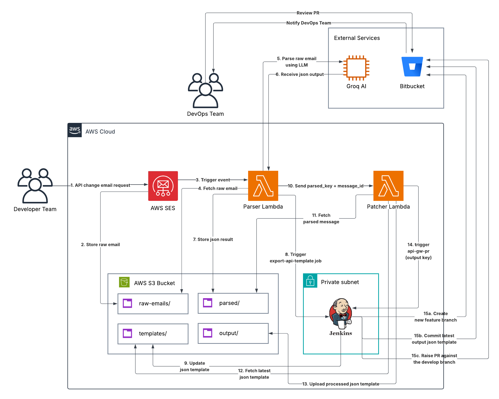

# API Gateway Email Automation

An end-to-end serverless automation system that processes API Gateway change requests sent via email. Developers send a structured email, and the system automatically parses it using AI, patches the OpenAPI template, and raises a Pull Request on BitBucket with no manual JSON editing required.

---

## Architecture



---

## The Problem It Solves

Every API Gateway change required a developer to manually open a large OpenAPI JSON template, locate or create the correct path block, write the full method configuration including VPC link, NLB URI, CORS headers, request parameters, and Cognito authorizer, then manually update the OPTIONS `Access-Control-Allow-Methods` header and do all of this without introducing a JSON syntax error that would break the entire API Gateway deployment.

This automation reduces that entire process to sending an email.

---

## How It Works

### Step 1 — Developer Sends an Email

A developer sends a structured email to an AWS SES verified address describing the API Gateway changes needed for a specific environment.

### Step 2 — Email Intake

AWS SES receives the email and stores the raw content in S3 under `raw-emails/`. The S3 upload event triggers the Parser Lambda.

### Step 3 — Fetch Latest Template

The Parser Lambda triggers the `export-api-template-{environment}` Jenkins job via the Jenkins REST API. Jenkins pulls the latest code from the `develop` branch of the BitBucket repository and uploads the current `openapi-definition.json` to S3 under `templates/`, ensuring the automation always works from the most up-to-date template.

### Step 4 — AI Parsing

The Parser Lambda sends the raw email body to the Groq AI API running the LLaMA 3.3 70B model. The AI extracts the target environment, all endpoints to add or update, and all endpoints to delete. It also handles markdown tables, plain text, mixed formatting, and inconsistent casing.

The structured parsed result is saved to S3 under `parsed/`.

### Step 5 — Patching

The Parser Lambda asynchronously invokes the Patcher Lambda. The Patcher reads the parsed JSON and the current OpenAPI template from S3, then applies all changes:

- **New path** — inserts the full method block including OPTIONS
- **Existing path, new method** — adds the method and updates the OPTIONS `Allow-Methods` header
- **Existing path, existing method** — overwrites the method block and syncs OPTIONS
- **Deletion** — removes the specified method, updates OPTIONS, and removes the entire path block if no methods remain

The patched template and a full audit log are saved to S3 under `output/`.

### Step 6 — Pull Request

The Patcher Lambda triggers the `raise-api-gw-pr` Jenkins job, passing the patched file S3 key as a parameter. Jenkins downloads the patched file, creates a feature branch named `api-gw-update-{timestamp}`, commits the updated template, and raises a Pull Request against `develop` on BitBucket via the BitBucket REST API.

### Step 7 — Review and Approval

The team reviews the Pull Request on BitBucket and merges it into `develop`.

### Step 8 — Terraform Deployment

The existing Jenkins deployment job for the target environment (`qa-deployment-script`, `dev-deployment-script`, `uat-deployment-script`, or `prod-deployment-script`) runs Terraform using the appropriate workspace and tfvars file, applying the changes to AWS API Gateway infrastructure.

---

## Repository Structure

```
api-gateway-email-automation/
├── lambdas/
│   ├── parser/
│   │   └── lambda_function.py       # Email parsing and AI integration
│   └── patcher/
│       └── lambda_function.py       # OpenAPI template patching logic
├── docs/
│   └── architecture-diagram.png     # System architecture diagram
├── .gitignore
└── README.md
```

<!-- ├── jenkins/
│   ├── export-api-template.sh       # Fetches latest template from BitBucket to S3
│   ├── raise-api-gw-pr.sh           # Creates feature branch and raises PR
│   └── qa-deployment-script.sh      # Terraform deployment (example for QA) -->

---

## Email Format

Emails can be formatted as markdown tables, plain text, or a mix. The AI handles flexible formatting.

**Example email:**

```
Hi Team,

Please action the following API Gateway changes for the QA environment.

Environment: QA

| Service Name       | Method | Path                        | Header        | Request Params |
|--------------------|--------|-----------------------------|---------------|----------------|
| consumer-service   | GET    | /private/v1/example         | Authorization | requestId      |
| consumer-service   | POST   | /private/v1/example         | -             | requestId      |

Remove the following endpoints (if any):

| Service Name          | Method | Path                          |
|-----------------------|--------|-------------------------------|
| authentication-service | DELETE | /auth/private/v1/profile      |

Thanks
```

**Supported fields:**

| Field | Description |
|---|---|
| Service Name | Must match a known service (see Supported Services) |
| Method | HTTP method: GET, POST, PUT, DELETE, PATCH |
| Path | Full API endpoint path including path variables e.g. `/deals/{dealId}/rebook` |
| Header | Include `Authorization` to enable Cognito auth, `-` or blank for none |
| Request Params | Comma-separated query parameter names |

---

## Supported Services

The following services are currently supported. The service name in the email must match one of these exactly (case-insensitive):

| Service Name | NLB Terraform Variable |
|---|---|
| `consumer-service` | `none_prod_nlb_port_consumer_service` |
| `admin-portal-service` | `none_prod_nlb_port_adminp_service` |
| `authentication-service` | `none_prod_nlb_port_auth_service` |

To add a new service, update the `SERVICE_NLB_MAP` dictionary in `lambdas/patcher/lambda_function.py`.

---

## Environment Support

The system supports four environments:

| Environment | Template Key |
|---|---|
| QA | `templates/private-qa.json` |
| DEV | `templates/private-dev.json` |
| UAT | `templates/private-uat.json` |
| PROD | `templates/private-prod.json` |

The environment is resolved from the email body using both AI extraction and a regex fallback. It is case-insensitive — `qa`, `Qa`, and `QA` all resolve correctly.

---

## S3 Bucket Structure

```
s3://your-bucket/
├── raw-emails/          # Raw emails stored by SES (keyed by SES message ID)
├── parsed/              # Structured JSON output from the Parser Lambda
├── templates/           # Current OpenAPI template per environment
└── output/              # Patched templates and audit logs
```

---

## Lambda Environment Variables

### Parser Lambda

| Variable | Description |
|---|---|
| `BUCKET` | S3 bucket name |
| `API_KEY` | Groq API key |
| `PATCHER` | Patcher Lambda function name |
| `JENKINS_URL` | Internal Jenkins URL e.g. `http://10.0.1.45:8080` |

### Patcher Lambda

| Variable | Description |
|---|---|
| `BUCKET` | S3 bucket name |
| `TEMPLATE_KEY` | S3 key of the OpenAPI template to patch |
| `OVERWRITE_TEMPLATE` | Set to `true` to overwrite the source template after patching |

---

## Jenkins Jobs

### `export-api-template-{environment}`
Pulls the latest `openapi-definition.json` from the `develop` branch of the BitBucket repository and uploads it to the S3 `templates/` prefix before patching begins. Triggered by the Parser Lambda via the Jenkins REST API.

### `raise-api-gw-pr`
Downloads the patched template from S3, commits it to a new feature branch, and raises a Pull Request against `develop` on BitBucket. Triggered by the Patcher Lambda after patching is complete. Accepts the patched S3 key as a build parameter.

### `{environment}-deployment-script`
Existing Terraform deployment jobs. Triggered after PR merge. Runs `terraform plan` and `terraform apply` using the appropriate workspace and tfvars file.

---

## Security

- Jenkins API token is stored in AWS Secrets Manager and fetched at runtime by the Parser Lambda — never stored as a plaintext environment variable
- The Jenkins EC2 instance is in a private subnet with no public exposure — Lambda communicates with it over the VPC
- A dedicated Jenkins service account with minimal permissions is used for Lambda-triggered jobs only

---

## Audit and Traceability

Every run produces an audit log saved to `output/audit-{timestamp}.json` containing:

```json
{
  "timestamp": "20260427-070818",
  "message_id": "2a2b7636-2740-4a6a-9a4e-ced2e3bb8947",
  "template_key": "templates/private-qa.json",
  "output_key": "output/private-qa-patched-20260427-070818.json",
  "overwrote_template": false,
  "added": ["GET /private/v1/example", "POST /private/v1/example"],
  "updated": [],
  "deleted": ["DELETE /auth/private/v1/profile"],
  "failed": []
}
```

The `message_id` links directly back to the original raw email at `raw-emails/{message_id}` in S3, giving full traceability from the deployed template change back to the email that triggered it.

---

## Future Improvements

- Polling or webhook callback to confirm Jenkins template sync before patching begins
- SNS or SES notification email back to the developer confirming the PR was raised

---

## Tech Stack

- **AWS SES** — Email ingestion
- **AWS Lambda** — Parser and Patcher (Python 3.12)
- **AWS S3** — Storage for emails, parsed data, templates, and output
- **AWS Secrets Manager** — Jenkins API token storage
- **Groq AI / LLaMA 3.3 70B** — Email parsing and endpoint extraction
- **Jenkins** — Template sync and PR creation jobs
- **BitBucket** — Source control and Pull Request workflow
- **Terraform** — API Gateway infrastructure deployment
